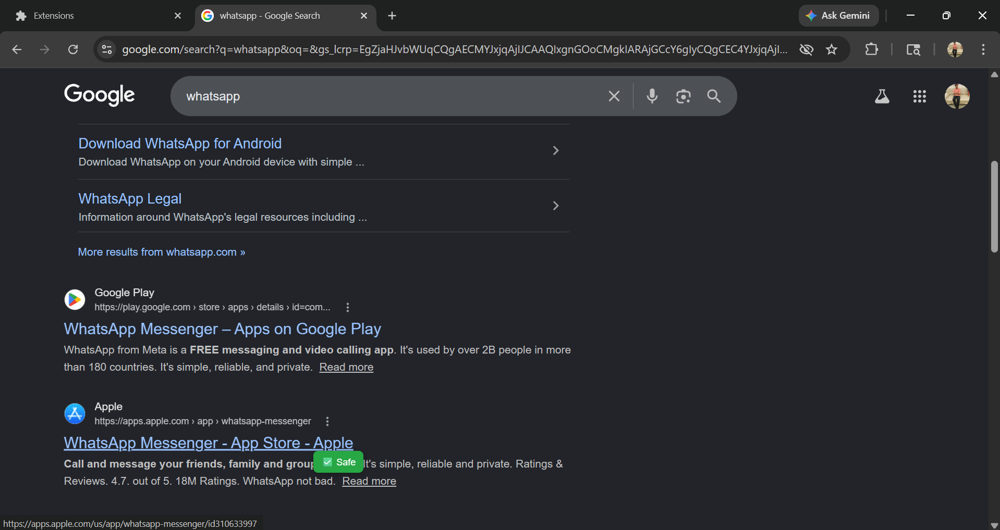
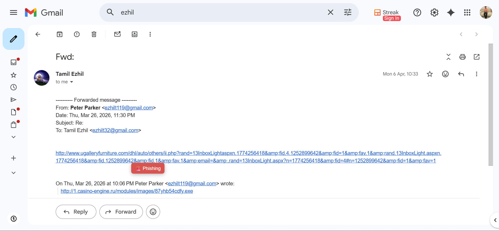

# 🚨 Real-Time Phishing URL Detection using Hybrid ANN-XGBoost Model with Chrome Extension

## 📌 Overview
Phishing attacks are one of the most common cybersecurity threats, where malicious URLs trick users into revealing sensitive information. This project presents a **real-time phishing URL detection system** that integrates a **hybrid machine learning model (ANN + XGBoost)** with a **Chrome extension**.

The system automatically captures URLs when a user hovers over a link and instantly classifies them as **Safe or Phishing**, eliminating the need for manual input and enabling seamless real-time protection.

---

## 🎯 Key Contributions
- Hybrid model combining ANN and XGBoost for high accuracy  
- Real-time phishing detection using Chrome extension  
- Automatic URL capture on hover (no manual input required)  
- Integration of machine learning with browser-based interface  
- Practical cybersecurity solution for real-world usage  

---

## ⚙️ Tech Stack
- **Language:** Python  
- **Machine Learning:** ANN, XGBoost  
- **Libraries:** Pandas, NumPy, Scikit-learn, TensorFlow/Keras, Joblib  
- **Frontend:** HTML, CSS, JavaScript  
- **Browser Integration:** Chrome Extension APIs  
- **Dataset:** Kaggle (Phishing URL dataset)  

---

## 🧠 Methodology

### 1. Data Collection
- Dataset collected from Kaggle containing phishing and legitimate URLs  

### 2. Feature Engineering
Extracted features such as:
- URL length  
- Special character count  
- HTTPS presence  
- Domain-based attributes  
- Suspicious keywords  

### 3. Model Development
- **Artificial Neural Network (ANN)** for learning complex patterns  
- **XGBoost** for efficient tabular classification  
- Hybrid approach improves overall performance and robustness  

### 4. Real-Time Detection System
- Chrome extension captures URL dynamically on hover  
- Sends request to backend server  
- Backend processes URL using trained model  
- Returns prediction instantly to extension  
- Displays popup alert:
  - ✅ Safe  
  - ⚠️ Phishing  

---

## 🏗️ System Architecture

User Hover → URL Capture → Backend Server → Feature Extraction → Hybrid Model → Prediction → Popup Alert


---

## 📊 Results

**Hybrid Model Performance:**

- Accuracy  : **98.60%**  
- Precision : **98.40%**  
- Recall    : **98.40%**  
- F1-Score  : **98.50%**

The hybrid model achieves high accuracy and strong generalization.

---

## 📸 Demo / Screenshots

### ✅ Safe Link Detection
The system detects legitimate URLs and displays a safe indication.



---

### ⚠️ Phishing Detection
The system detects malicious URLs and alerts the user instantly.



---

## ⚙️ Backend Server

The system runs a local backend server to handle real-time URL classification.

### Run the server:
python app.py

You will see:

Running on http://127.0.0.1:5000


This indicates that the backend server is active.

👉 The Chrome extension communicates with this server to analyze URLs and return predictions in real time.

---

## 📂 Project Structure

```
phishing-url-detector/
│── app.py
│── ann.py
│── xgbst.py
│── feature_extractor.py
│── evaluation.py
│── train_and_save.py
│── load.py
│
│── ann_model.keras
│── xgb_model.pkl
│── scaler.pkl
│
│── extension/
│   ├── background.js
│   ├── content.js
│   ├── manifest.json
│   ├── popup.css
│   ├── popup.html
│   ├── popup.js
│
│── images/
│   ├── safe-phishing-detection.png
│   ├── unsafe-phishing-detection.png
│
│── requirements.txt
│── README.md
```


---

## ▶️ How to Run

### 1. Clone repository
git clone https://github.com/TAMIL-EZHIL-R/Phishing-url-detector.git

### 2. Install dependencies
pip install -r requirements.txt

### 3. Start backend server
python app.py


👉 Keep this running in the background.

---

### 4. Load Chrome Extension
- Open Chrome → Extensions  
- Enable Developer Mode  
- Click “Load unpacked”  
- Select the `phishing_extension/` folder  

---

### 5. Use the System
- Open any website  
- Hover over links  
- Extension will show:
  - ✅ Safe  
  - ⚠️ Phishing  

---

## 💡 Features
- 🔍 Real-time phishing detection  
- ⚡ Instant response system  
- 🧠 Hybrid machine learning model  
- 🌐 Chrome extension integration  
- 🛡️ Enhances user security  

---

## 🚀 Future Improvements
- Deploy backend as cloud API  
- Integrate deep learning models (LSTM, Transformers)  
- Extend support to multiple browsers  
- Continuous learning from new phishing datasets  

---

## 🎓 Research Relevance
This project reflects a strong interest in **cybersecurity and intelligent systems**, focusing on real-time threat detection using machine learning.

---

## 👤 Author
**TAMIL EZHIL R**  
B.E Computer Science&Engineering(Cyber Security)  
K.L.N. College of Engineering  

---

## ⭐ Acknowledgment
Dataset sourced from Kaggle (Phishing URL dataset)
